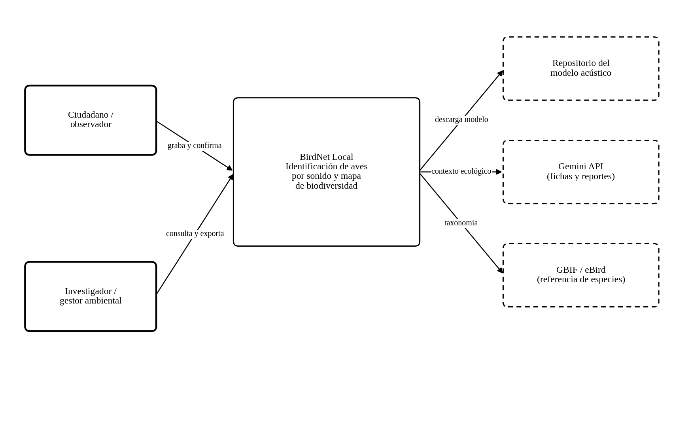
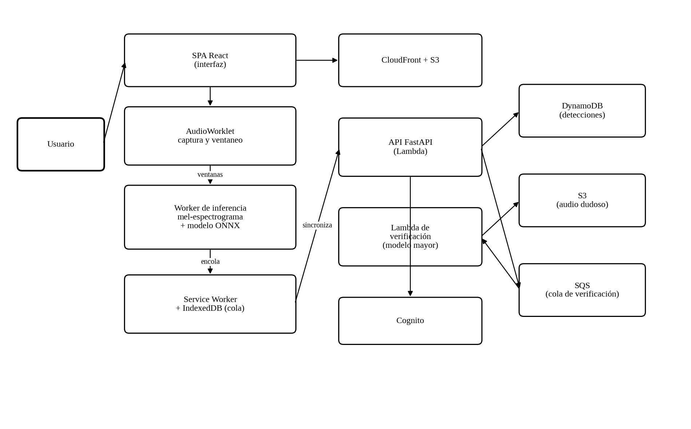
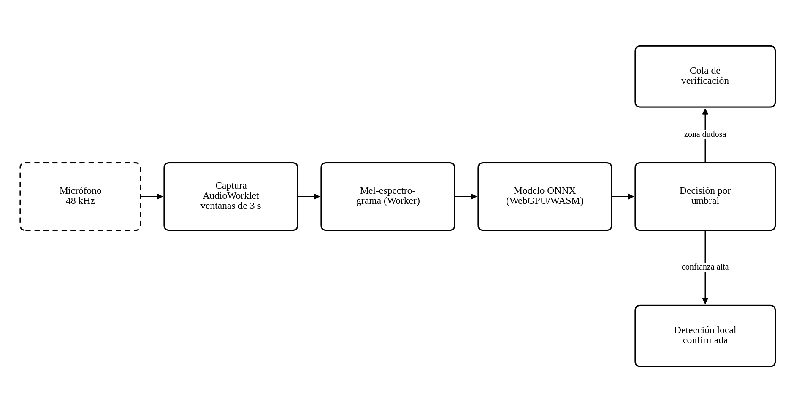

**BirdNet Local: aplicación web progresiva para el monitoreo continuo de biodiversidad mediante identificación acústica de aves con inferencia híbrida**

Jose Luis Burbano Buchelly

Programación Orientada a la Web

Documento de definición técnica del proyecto

26 de septiembre de 2026

# **Introducción**

Este documento establece la definición técnica de BirdNet Local con anterioridad a su construcción: el problema que atiende, su alcance, su arquitectura, las tecnologías seleccionadas y los criterios de finalización. De los tres proyectos de la asignatura, este es el que opera en las condiciones más adversas —al aire libre, sin conexión, en dispositivos de gama modesta y con batería limitada—, circunstancias que condicionan el diseño de manera profunda y que conviene fijar desde el inicio.

El proyecto resulta además especialmente representativo de las capacidades de la web moderna, pues reúne en una sola aplicación la captura de audio, la ejecución de un modelo de aprendizaje profundo en el propio navegador, el funcionamiento sin conexión con sincronización diferida y la geolocalización, todo ello sin necesidad de instalación desde una tienda de aplicaciones.

# **Planteamiento del problema**

Evaluar el estado de la fauna de un territorio requiere, en el método tradicional, que biólogos de campo realicen censos presenciales. El procedimiento es riguroso pero costoso, y esa condición determina cuándo y dónde se aplica: se concentra en áreas protegidas y en proyectos con financiación específica, y rara vez se sostiene en el tiempo. La consecuencia es una brecha de información considerable, pues la mayor parte del territorio —barrios, veredas, fincas, corredores periurbanos— carece por completo de seguimiento.

Esa ausencia importa más de lo que parece. Las aves son indicadoras sensibles del estado de un ecosistema: su composición cambia antes y de forma más perceptible que otros elementos del sistema ante transformaciones del uso del suelo, la contaminación acústica o la variación climática. Sin un seguimiento sostenido, esos cambios solo se advierten cuando ya son severos.

La identificación acústica automatizada ofrece una salida, y existen modelos capaces de reconocer especies a partir de su vocalización con buen desempeño (Kahl et al., 2021). Sin embargo, las soluciones disponibles presentan dos limitaciones prácticas. Unas requieren hardware dedicado instalado en campo, con su costo y su mantenimiento. Otras son aplicaciones móviles que exigen instalación, ocupan espacio y, en varios casos, envían el audio a un servidor, lo cual las vuelve inservibles precisamente donde más se necesitan: en zonas rurales con cobertura intermitente o nula.

El problema, en términos de programación web, se formula así: **cómo ejecutar un modelo de aprendizaje profundo sobre audio en tiempo real dentro de un navegador, en un dispositivo de gama media, sin conexión y sin agotar la batería**, manteniendo la interfaz fluida y garantizando que ninguna detección se pierda cuando la red no está disponible. Cada una de esas condiciones empuja el diseño en una dirección distinta, y conciliarlas es el núcleo del trabajo.

# **Objetivos**

## **Objetivo general**

Diseñar y construir una aplicación web progresiva que identifique especies de aves a partir del sonido captado por el micrófono del dispositivo, ejecutando un modelo de clasificación acústica en el propio navegador, verificando en la nube únicamente las detecciones de confianza intermedia, y registrando los resultados con su ubicación y momento para construir de forma progresiva un mapa de biodiversidad a escala local, todo ello con capacidad de operar sin conexión a internet.

## **Objetivos específicos**

- Implementar la captura continua de audio y su segmentación en ventanas solapadas dentro del hilo de audio, sin interrumpir la interfaz.

- Calcular el mel-espectrograma de cada ventana en un hilo de trabajo y ejecutar sobre él el modelo de clasificación exportado a formato ONNX.

- Definir e implementar la política de decisión híbrida que determina cuándo una detección se acepta localmente y cuándo se remite a verificación en la nube.

- Construir el mecanismo de funcionamiento sin conexión: cola persistente de detecciones, sincronización diferida en segundo plano y resolución de conflictos.

- Registrar cada detección con su ubicación aproximada, fecha y confianza, y representarlas sobre un mapa con filtros por especie y periodo.

- Integrar un modelo de lenguaje que genere fichas divulgativas de las especies detectadas y redacte informes periódicos del sitio monitoreado.

- Optimizar el consumo energético y de memoria hasta permitir sesiones de al menos una hora de escucha continua en un dispositivo de gama media.

- Desplegar la solución sobre infraestructura sin servidor en AWS y verificar el cumplimiento de los requisitos no funcionales mediante pruebas automatizadas.

# **Alcance y delimitación**

**Tabla 1**

*Delimitación del alcance de BirdNet Local*

| **Dentro del alcance**                                                      | **Fuera del alcance**                                                        |
|-----------------------------------------------------------------------------|------------------------------------------------------------------------------|
| Captura de audio desde el micrófono del dispositivo en ventanas solapadas.  | Integración con grabadoras autónomas o hardware de campo dedicado.           |
| Inferencia en el navegador con un modelo acústico preentrenado y exportado. | Entrenamiento de un modelo propio desde cero.                                |
| Verificación en la nube de las detecciones de confianza intermedia.         | Verificación experta por parte de ornitólogos dentro del sistema.            |
| Catálogo de especies acotado a la región de despliegue.                     | Cobertura mundial de todas las especies del modelo original.                 |
| Registro de detecciones con ubicación aproximada y momento.                 | Ubicación de precisión submétrica o seguimiento continuo de la posición.     |
| Mapa y estadísticas locales con filtros por especie y periodo.              | Análisis ecológico formal, estimación de abundancia o índices poblacionales. |
| Funcionamiento sin conexión con sincronización diferida.                    | Transmisión de audio en vivo hacia el servidor.                              |
| Fichas divulgativas e informes generados por el modelo de lenguaje.         | Uso de los datos como evidencia legal, regulatoria o de impacto ambiental.   |

*Nota.* El sistema produce indicios, no determinaciones. Toda detección se presenta acompañada de su nivel de confianza y de la advertencia de que requiere confirmación por parte de una persona con criterio para constituir un registro válido.

Dos exclusiones merecen justificación. La primera es el entrenamiento del modelo: entrenar un clasificador acústico competitivo exige decenas de miles de grabaciones etiquetadas y semanas de cómputo en aceleradores gráficos, lo que excede tanto el plazo como los recursos del proyecto; se parte por ello de un modelo preentrenado y el trabajo propio se concentra en su exportación, cuantización y ejecución eficiente en el navegador, que es precisamente el problema de ingeniería web. La segunda es la precisión de la ubicación: el sistema registra deliberadamente una posición aproximada, decisión que protege la privacidad del usuario y, adicionalmente, evita revelar la localización exacta de especies sensibles.

# **Actores e historias de usuario**

**Tabla 2**

*Actores identificados y sus objetivos*

| **Actor**             | **Descripción**                                                                                                  | **Objetivo principal**                                                 |
|-----------------------|------------------------------------------------------------------------------------------------------------------|------------------------------------------------------------------------|
| Observador ciudadano  | Persona interesada en la naturaleza, sin formación especializada, que usa la aplicación en su entorno cotidiano. | Saber qué aves hay a su alrededor y contribuir a un registro continuo. |
| Investigador o gestor | Profesional que consulta los datos acumulados de una zona.                                                       | Detectar cambios en la composición de especies a lo largo del tiempo.  |
| Docente o estudiante  | Usuario en contexto educativo.                                                                                   | Emplear la aplicación como herramienta de aprendizaje en campo.        |
| Administrador         | Responsable técnico.                                                                                             | Publicar versiones del modelo y supervisar la operación.               |

**Tabla 3**

*Historias de usuario y criterios de aceptación*

| **Id** | **Historia**                                                                           | **Criterio de aceptación**                                                                                |
|--------|----------------------------------------------------------------------------------------|-----------------------------------------------------------------------------------------------------------|
| HU-01  | Como observador quiero abrir la aplicación y empezar a escuchar con un solo toque.     | La escucha comienza en menos de 3 s desde el toque, con permiso de micrófono ya concedido.                |
| HU-02  | Como observador quiero ver qué ave se ha detectado mientras sigo escuchando.           | La detección aparece en menos de 4 s desde el final de la ventana analizada.                              |
| HU-03  | Como observador quiero saber qué tan confiable es cada detección.                      | Cada resultado muestra su confianza y su estado de verificación de forma comprensible, sin jerga técnica. |
| HU-04  | Como observador quiero usar la aplicación en el campo sin señal.                       | La identificación funciona completa sin red y las detecciones quedan en cola local.                       |
| HU-05  | Como observador quiero que mis detecciones se suban solas cuando vuelva a tener señal. | La cola se sincroniza en segundo plano sin intervención y sin duplicar registros.                         |
| HU-06  | Como observador quiero confirmar o corregir una detección.                             | La corrección queda registrada y se distingue de la detección automática.                                 |
| HU-07  | Como observador quiero ver en un mapa las aves detectadas en mi zona.                  | El mapa muestra las detecciones agrupadas, con filtros por especie y periodo.                             |
| HU-08  | Como observador quiero aprender algo sobre la especie detectada.                       | Se muestra una ficha divulgativa, marcada como texto generado automáticamente.                            |
| HU-09  | Como investigador quiero exportar los datos de una zona y un periodo.                  | La exportación en CSV incluye especie, confianza, momento, ubicación aproximada y estado de verificación. |
| HU-10  | Como observador quiero que la aplicación no agote mi batería.                          | Una hora de escucha continua consume menos del 25 % de batería en un dispositivo de referencia.           |

# **Requisitos**

## **Requisitos funcionales**

**Tabla 4**

*Requisitos funcionales de BirdNet Local*

| **Id** | **Requisito**                                                                                         | **Prioridad** |
|--------|-------------------------------------------------------------------------------------------------------|---------------|
| RF-01  | Solicitar y gestionar el permiso de micrófono, informando con claridad del uso que se le dará.        | Alta          |
| RF-02  | Capturar audio de forma continua y segmentarlo en ventanas solapadas de duración fija.                | Alta          |
| RF-03  | Remuestrear y normalizar la señal a las condiciones de entrada del modelo.                            | Alta          |
| RF-04  | Calcular el mel-espectrograma de cada ventana fuera del hilo principal.                               | Alta          |
| RF-05  | Ejecutar el modelo de clasificación en el navegador y obtener la distribución de especies candidatas. | Alta          |
| RF-06  | Aplicar la política de decisión híbrida según los umbrales de confianza definidos.                    | Alta          |
| RF-07  | Encolar localmente las detecciones y el audio de las dudosas, con límite de espacio configurable.     | Alta          |
| RF-08  | Sincronizar la cola en segundo plano cuando haya conexión, de forma idempotente.                      | Alta          |
| RF-09  | Verificar en la nube las detecciones de confianza intermedia mediante un modelo de mayor tamaño.      | Media         |
| RF-10  | Registrar cada detección con especie, confianza, momento y ubicación aproximada.                      | Alta          |
| RF-11  | Permitir al usuario confirmar, corregir o descartar una detección.                                    | Media         |
| RF-12  | Mostrar las detecciones sobre un mapa con agrupamiento y filtros.                                     | Alta          |
| RF-13  | Presentar estadísticas del sitio: especies distintas, frecuencia y evolución temporal.                | Media         |
| RF-14  | Generar fichas divulgativas de las especies mediante el modelo de lenguaje.                           | Media         |
| RF-15  | Producir informes periódicos del sitio monitoreado.                                                   | Baja          |
| RF-16  | Exportar los datos de una zona y un periodo en formato CSV.                                           | Media         |
| RF-17  | Instalarse como aplicación y funcionar sin conexión desde el primer uso.                              | Alta          |
| RF-18  | Descargar y actualizar la versión del modelo sin redesplegar la aplicación.                           | Media         |

## **Requisitos no funcionales**

**Tabla 5**

*Requisitos no funcionales de BirdNet Local*

| **Id** | **Atributo**                | **Requisito verificable**                                                                             |
|--------|-----------------------------|-------------------------------------------------------------------------------------------------------|
| RNF-01 | Latencia de inferencia      | El análisis de una ventana de 3 s concluye en menos de 1,5 s en un dispositivo de gama media.         |
| RNF-02 | Continuidad                 | La captura no pierde ninguna ventana durante 60 minutos de escucha continua.                          |
| RNF-03 | Capacidad de respuesta      | Ninguna tarea del hilo principal excede 50 ms durante la escucha.                                     |
| RNF-04 | Consumo energético          | Menos del 25 % de batería por hora de escucha en el dispositivo de referencia.                        |
| RNF-05 | Tamaño de descarga          | La aplicación y el modelo cuantizado no superan los 25 MB en la primera carga.                        |
| RNF-06 | Funcionamiento sin conexión | Identificación completa sin red, con cola persistente de al menos 500 detecciones.                    |
| RNF-07 | Integridad de datos         | Ninguna detección se pierde ni se duplica ante cortes de red o cierres inesperados.                   |
| RNF-08 | Privacidad                  | El audio no abandona el dispositivo salvo en las detecciones dudosas y previa autorización explícita. |
| RNF-09 | Precisión declarada         | Toda detección se acompaña de su confianza; ninguna se presenta como certeza.                         |
| RNF-10 | Accesibilidad               | Nivel AA de las WCAG 2.1, con interfaz utilizable a plena luz solar y con una sola mano.              |
| RNF-11 | Compatibilidad              | Chrome y Edge en Android y escritorio; Safari en iOS con las limitaciones documentadas.               |
| RNF-12 | Costo                       | Menos de cinco dólares mensuales en condiciones académicas.                                           |

# **Arquitectura de la solución**

## **Estilo arquitectónico y justificación**

La arquitectura responde al estilo **local primero**: el dispositivo es la fuente de verdad durante la sesión de campo y la nube actúa como destino de sincronización eventual. Esta elección no es una preferencia estética sino una consecuencia directa del contexto de uso. Una aplicación de monitoreo de biodiversidad se utiliza precisamente donde la conectividad es peor, de modo que un diseño que dependiera de la red fallaría justo en su escenario objetivo.

Sobre esa base se superpone una **inferencia híbrida en dos niveles**. Un modelo pequeño y cuantizado se ejecuta en el navegador y resuelve la mayoría de los casos; las detecciones cuya confianza cae en una zona intermedia se encolan para ser verificadas por un modelo mayor en la nube cuando haya conexión. El criterio de diseño es sencillo de enunciar: resolver localmente todo lo que se pueda y recurrir al servidor solo cuando aporte un valor que el cliente no puede proporcionar.

La ventaja de este esquema es doble. Por un lado, el volumen de datos transmitidos disminuye drásticamente, pues solo viaja el audio de las detecciones dudosas —una fracción pequeña del total— en lugar del flujo completo. Por otro, la privacidad mejora de manera sustantiva: un micrófono abierto en el entorno de una persona capta inevitablemente conversaciones, y el diseño garantiza que ese audio permanezca en el dispositivo salvo en los casos acotados que el usuario autorice.

## **Vista de contexto**

**Figura 1**

*Diagrama de contexto de BirdNet Local*

*Nota.* Elaboración propia con base en el modelo C4 (Brown, 2018).

## **Vista de contenedores**

**Figura 2**

*Diagrama de contenedores de BirdNet Local*

*Nota.* Elaboración propia.

**Tabla 6**

*Responsabilidad de cada contenedor*

| **Contenedor**             | **Responsabilidad**                                                | **Tecnología**                              |
|----------------------------|--------------------------------------------------------------------|---------------------------------------------|
| Aplicación de página única | Interfaz, mapa y coordinación de la sesión de escucha.             | React 19, TypeScript, Vite, MapLibre        |
| Captura de audio           | Segmentar la señal en ventanas y entregarlas sin pérdidas.         | AudioWorklet, Web Audio API                 |
| Hilo de inferencia         | Calcular el mel-espectrograma y ejecutar el modelo.                | Web Worker, ONNX Runtime Web, WebGPU o WASM |
| Trabajador de servicio     | Funcionamiento sin conexión, cola y sincronización diferida.       | Workbox, IndexedDB, Background Sync         |
| Interfaz de programación   | Recibir detecciones, servir consultas y coordinar la verificación. | FastAPI sobre AWS Lambda                    |
| Servicio de verificación   | Ejecutar el modelo mayor sobre el audio dudoso.                    | AWS Lambda con contenedor y SQS             |
| Almacén de detecciones     | Persistir las detecciones y su estado de verificación.             | Amazon DynamoDB                             |
| Almacén de audio           | Conservar temporalmente los fragmentos pendientes de verificar.    | Amazon S3 con expiración automática         |

## **Cadena de procesamiento y política de decisión**

**Figura 3**

*Cadena de procesamiento de audio y decisión híbrida*

*Nota.* Elaboración propia.

La política de decisión constituye el elemento distintivo de la arquitectura y se define mediante dos umbrales sobre la confianza que devuelve el modelo local.

**Tabla 7**

*Política de decisión híbrida*

| **Rango de confianza**   | **Acción del sistema**                                                                       | **Justificación**                                                                                           |
|--------------------------|----------------------------------------------------------------------------------------------|-------------------------------------------------------------------------------------------------------------|
| Alta (≥ 0,80)            | Se acepta localmente y se registra como detección confirmada por el modelo.                  | En este rango la precisión del modelo local es suficiente; verificar aportaría poco y costaría transmisión. |
| Intermedia (0,45 – 0,80) | Se registra como provisional y se encola el fragmento de audio para verificación en la nube. | Es la zona donde el modelo mayor aporta una mejora real de precisión.                                       |
| Baja (\< 0,45)           | Se descarta sin registrar ni almacenar audio.                                                | Registrar ruido degradaría la calidad del conjunto de datos y consumiría espacio.                           |

*Nota.* Los umbrales se fijan inicialmente con base en la curva de precisión y exhaustividad medida sobre el conjunto de validación, y se ajustan tras las pruebas de campo.

Conviene subrayar una consecuencia de esta política que no es evidente a primera vista. El sistema no envía audio a la nube de forma indiscriminada, sino únicamente los fragmentos que caen en la banda intermedia. Si el modelo local funciona bien, esa banda representa una fracción reducida del total, de modo que **el costo de operación y el volumen de datos transmitidos disminuyen a medida que mejora el modelo local**. La arquitectura premia, por tanto, la mejora del cliente, lo que constituye un incentivo alineado con los objetivos del proyecto.

# **Registros de decisión de arquitectura**

**Tabla 8**

*ADR-01. Ejecutar la inferencia principal en el navegador*

| **Campo**     | **Contenido**                                                                                                                                                                                                          |
|---------------|------------------------------------------------------------------------------------------------------------------------------------------------------------------------------------------------------------------------|
| Contexto      | El uso previsto ocurre en campo, con conectividad intermitente o nula, y el micrófono capta el entorno de la persona.                                                                                                  |
| Decisión      | El modelo de clasificación se ejecuta en el dispositivo mediante ONNX Runtime Web dentro de un hilo de trabajo.                                                                                                        |
| Alternativas  | Envío del audio al servidor para su análisis; hardware dedicado en campo.                                                                                                                                              |
| Consecuencias | La aplicación funciona sin conexión, el audio no sale del dispositivo y el costo de servidor es mínimo. A cambio, el modelo debe cuantizarse, lo que reduce algo su precisión, y el desempeño depende del dispositivo. |

**Tabla 9**

*ADR-02. Adoptar un esquema de verificación híbrido en dos niveles*

| **Campo**     | **Contenido**                                                                                                                                                                                              |
|---------------|------------------------------------------------------------------------------------------------------------------------------------------------------------------------------------------------------------|
| Contexto      | El modelo cuantizado pierde precisión en los casos difíciles, que son justamente los de mayor interés.                                                                                                     |
| Decisión      | Las detecciones de confianza intermedia se encolan y se verifican en la nube con un modelo de mayor tamaño.                                                                                                |
| Alternativas  | Confiar únicamente en el modelo local; verificar todas las detecciones.                                                                                                                                    |
| Consecuencias | Se recupera precisión donde importa sin renunciar al funcionamiento sin conexión, y el costo se mantiene acotado. Se introduce, eso sí, un estado provisional que la interfaz debe comunicar con claridad. |

**Tabla 10**

*ADR-03. Diseñar la sincronización como idempotente y en segundo plano*

| **Campo**     | **Contenido**                                                                                                                                                                                |
|---------------|----------------------------------------------------------------------------------------------------------------------------------------------------------------------------------------------|
| Contexto      | La conexión aparece y desaparece; la aplicación puede cerrarse en cualquier momento durante una sincronización.                                                                              |
| Decisión      | Cada detección lleva un identificador generado en el cliente y el servidor trata los envíos repetidos como una sola operación; la sincronización se delega al trabajador de servicio.        |
| Alternativas  | Sincronización inmediata desde el hilo principal con reintentos simples.                                                                                                                     |
| Consecuencias | Ninguna detección se pierde ni se duplica, y la sincronización progresa aunque la aplicación no esté en primer plano. El costo es una mayor complejidad en la gestión del estado de la cola. |

**Tabla 11**

*ADR-04. Registrar la ubicación de forma deliberadamente imprecisa*

| **Campo**     | **Contenido**                                                                                                                                        |
|---------------|------------------------------------------------------------------------------------------------------------------------------------------------------|
| Contexto      | La ubicación exacta revela el domicilio del usuario y la localización de especies potencialmente sensibles.                                          |
| Decisión      | Las coordenadas se redondean a una cuadrícula de aproximadamente cien metros antes de almacenarse.                                                   |
| Alternativas  | Almacenar la coordenada exacta del dispositivo.                                                                                                      |
| Consecuencias | Se protegen la privacidad del usuario y la de las especies, con una resolución que sigue siendo suficiente para el análisis a escala local previsto. |

**Tabla 12**

*ADR-05. Servir el modelo como recurso versionado e independiente*

| **Campo**     | **Contenido**                                                                                                                                                                         |
|---------------|---------------------------------------------------------------------------------------------------------------------------------------------------------------------------------------|
| Contexto      | El modelo evolucionará con más frecuencia que el código de la aplicación.                                                                                                             |
| Decisión      | El modelo se publica como un recurso versionado, se descarga por separado y el trabajador de servicio lo conserva en caché.                                                           |
| Alternativas  | Empaquetar el modelo dentro del paquete de la aplicación.                                                                                                                             |
| Consecuencias | El modelo se actualiza sin redesplegar el cliente y la primera carga es más ligera. Se debe gestionar, en contrapartida, la compatibilidad entre versiones de modelo y de aplicación. |

# **Modelo de concurrencia y rendimiento**

El reto de concurrencia de este proyecto es distinto al de los anteriores: aquí no se trata de una única tarea pesada ocasional, sino de un **flujo sostenido de trabajo periódico** que debe mantenerse durante una hora sin perder una sola ventana de audio y sin agotar la batería.

## **Distribución del trabajo entre contextos de ejecución**

**Tabla 13**

*Asignación de cada tarea a su contexto de ejecución*

| **Tarea**                        | **Contexto**           | **Periodicidad** | **Razón de la asignación**                                                 |
|----------------------------------|------------------------|------------------|----------------------------------------------------------------------------|
| Captura y segmentación del audio | Hilo de audio          | Cada 2,7 ms      | Solo este contexto garantiza que no se pierdan muestras                    |
| Remuestreo y normalización       | Hilo de audio          | Por ventana      | Operación ligera que evita transferir audio innecesario                    |
| Mel-espectrograma                | Worker                 | Cada 1,5 s       | Requiere transformada de Fourier: demasiado costoso para el hilo principal |
| Inferencia del modelo            | Worker                 | Cada 1,5 s       | Cientos de milisegundos de cómputo; bloquearía la interfaz                 |
| Escritura en la cola local       | Worker                 | Por detección    | Evita que la entrada y salida interfiera con la interfaz                   |
| Sincronización con la nube       | Trabajador de servicio | Oportunista      | Debe progresar aunque la aplicación no esté en primer plano                |
| Interfaz y mapa                  | Hilo principal         | Por cuadro       | Único contexto con acceso al árbol del documento                           |

## **El problema de la contrapresión**

Si el modelo tarda más en analizar una ventana de lo que tarda la siguiente en generarse, el sistema acumula un retraso creciente hasta agotar la memoria. Este fenómeno, conocido como contrapresión, es característico de los sistemas de procesamiento continuo y debe resolverse explícitamente en el diseño, no descubrirse en producción.

La solución adoptada consiste en una cola acotada de una sola ventana con política de descarte del elemento más antiguo: si llega una ventana nueva mientras la anterior aún se procesa, se descarta la pendiente y se conserva la más reciente. Esta decisión se apoya en una observación propia del dominio: un ave que vocaliza lo hace habitualmente de forma repetida, de modo que perder una ventana ocasional no implica perder la detección, mientras que acumular retraso sí compromete el sistema completo. Se prefiere, en suma, una degradación previsible a un fallo catastrófico.

## **Consumo energético**

El consumo de batería es un requisito de primer orden, dado que la aplicación se usa en campo y lejos de una fuente de alimentación. Tres medidas concurren a controlarlo. La primera es la elección del intervalo de análisis: analizar ventanas de tres segundos cada segundo y medio proporciona solapamiento suficiente sin duplicar el trabajo. La segunda es la preferencia por la aceleración gráfica cuando el dispositivo la ofrece, pues resulta más eficiente por inferencia que la ejecución sobre el procesador, con retorno automático a WebAssembly con instrucciones vectoriales en caso contrario. La tercera es la suspensión del análisis cuando la aplicación deja de ser visible, salvo que el usuario active de forma explícita el modo de escucha prolongada.

## **Gestión de la memoria**

El modelo cuantizado ocupa del orden de diez megabytes en memoria y se carga una sola vez, al iniciar la sesión. Los búferes de audio y de espectrograma se reservan también una única vez y se reutilizan en cada ventana, evitando así generar basura que provocaría pausas del recolector en mitad del flujo. La transferencia de las ventanas entre el hilo de audio y el hilo de inferencia se realiza mediante objetos transferibles, que trasladan la propiedad del búfer sin copiarlo.

# **Integración de la inteligencia artificial**

La inteligencia artificial es aquí el componente central del sistema y no un añadido, por lo que conviene precisar sus tres papeles.

## **Modelo acústico local**

Se parte de un clasificador de vocalizaciones preentrenado, cuya entrada es el mel-espectrograma de una ventana de tres segundos y cuya salida es una distribución de probabilidad sobre el conjunto de especies. El trabajo propio del proyecto consiste en exportarlo a formato ONNX, aplicar cuantización a enteros de ocho bits para reducir su tamaño y acelerar la inferencia, restringir el conjunto de salida a las especies de la región de despliegue y medir el compromiso entre precisión y tamaño resultante.

La restricción regional del catálogo merece un comentario, pues no es un simple recorte. Reducir el número de clases candidatas disminuye el tamaño del modelo y, más importante aún, elimina de raíz confusiones con especies que no habitan la zona. Un filtro geográfico bien aplicado puede mejorar la precisión efectiva más que un modelo de mayor capacidad.

## **Modelo de verificación en la nube**

Las detecciones de confianza intermedia se procesan con la versión del modelo en precisión completa, ejecutada en una función Lambda empaquetada como contenedor y alimentada por una cola de mensajes. El procesamiento por lotes resulta aquí apropiado, dado que la verificación es diferida por naturaleza y no requiere respuesta inmediata.

## **Modelo de lenguaje**

El modelo de lenguaje cumple funciones divulgativas y de síntesis: genera fichas accesibles de las especies detectadas, a partir de datos taxonómicos recuperados de fuentes públicas, y redacta informes periódicos que describen en lenguaje llano la evolución observada en un sitio.

Rigen dos restricciones. El modelo **no identifica especies**: jamás recibe audio ni espectrogramas, y la identificación corresponde exclusivamente a los modelos acústicos. Y el modelo **no infiere tendencias ecológicas por su cuenta**: las estadísticas se calculan de forma determinista sobre la base de datos y el modelo únicamente las redacta, de modo que toda cifra del informe sea verificable.

# **Modelo de datos y diseño de la interfaz de programación**

**Tabla 14**

*Diseño de claves de la tabla única*

| **Entidad**           | **Clave de partición** | **Clave de ordenación** | **Atributos principales**                               |
|-----------------------|------------------------|-------------------------|---------------------------------------------------------|
| Usuario               | USER#\<id\>            | PROFILE                 | alias, preferencias, región                             |
| Detección             | GEO#\<celda\>          | TS#\<marca\>#\<ulid\>   | especie, confianza, estado, versión del modelo, usuario |
| Detección por usuario | USER#\<id\>            | DET#\<marca\>           | referencia a la detección                               |
| Sitio                 | USER#\<id\>            | SITE#\<id\>             | nombre, celda geográfica, fecha de creación             |
| Resumen de sitio      | SITE#\<id\>            | STAT#\<mes\>            | especies distintas, conteos, índice de variación        |
| Versión de modelo     | MODEL                  | VER#\<n\>               | ruta, tamaño, umbrales, métricas                        |

*Nota.* La celda geográfica como clave de partición permite consultar de forma eficiente todas las detecciones de una zona, que es el patrón de acceso dominante del mapa.

**Tabla 15**

*Puntos de acceso principales de la interfaz*

| **Método y ruta**              | **Propósito**                                          | **Autenticación** |
|--------------------------------|--------------------------------------------------------|-------------------|
| POST /v1/detections/batch      | Enviar un lote de detecciones desde la cola local      | Requerida         |
| POST /v1/detections/{id}/audio | Subir el fragmento de audio para verificación          | Requerida         |
| GET /v1/detections             | Consultar detecciones por zona, especie y periodo      | Requerida         |
| PATCH /v1/detections/{id}      | Confirmar, corregir o descartar una detección          | Requerida         |
| GET /v1/sites/{id}/stats       | Obtener las estadísticas de un sitio                   | Requerida         |
| POST /v1/species/{id}/card     | Generar la ficha divulgativa de una especie            | Requerida         |
| GET /v1/model/latest           | Consultar la versión vigente del modelo y sus umbrales | Pública           |
| GET /v1/export                 | Exportar detecciones en CSV                            | Requerida         |
| GET /v1/health                 | Verificar el estado del servicio                       | Pública           |

El punto de envío por lotes merece detalle por ser el más delicado del sistema. Recibe un conjunto de detecciones, cada una con el identificador único generado en el cliente, y responde indicando cuáles fueron aceptadas y cuáles ya existían. Esta respuesta permite al cliente vaciar su cola con seguridad: un envío repetido por un corte de red no genera duplicados, porque el servidor reconoce los identificadores ya registrados. Esta propiedad, la idempotencia, es la que hace posible reintentar sin miedo, y constituye el fundamento de toda sincronización fiable.

# **Infraestructura, despliegue y operación**

**Tabla 16**

*Servicios de AWS empleados y su función*

| **Servicio**          | **Función en el sistema**                                                        | **Consideración de costo**                                   |
|-----------------------|----------------------------------------------------------------------------------|--------------------------------------------------------------|
| S3                    | Alojar la aplicación, las versiones del modelo y el audio pendiente de verificar | Capa gratuita; expiración automática del audio a los 30 días |
| CloudFront            | Distribuir la aplicación y el modelo desde el borde de la red                    | Capa gratuita de 1 TB                                        |
| API Gateway           | Exponer la interfaz y limitar la tasa de peticiones                              | Por millón de peticiones                                     |
| Lambda                | Ejecutar la interfaz FastAPI                                                     | Un millón de invocaciones sin costo                          |
| Lambda con contenedor | Ejecutar el modelo de verificación por lotes                                     | Invocación solo ante detecciones dudosas                     |
| SQS                   | Encolar las verificaciones pendientes y amortiguar los picos                     | Capa gratuita de 1 millón                                    |
| DynamoDB              | Persistir detecciones, sitios y estadísticas                                     | Modo bajo demanda                                            |
| Cognito               | Autenticar usuarios                                                              | Gratuito en el rango previsto                                |
| CloudWatch            | Trazas, métricas y alarmas                                                       | Capa gratuita                                                |

El uso de una cola entre la interfaz y el servicio de verificación no responde a un afán de sofisticación. Cumple una función concreta: cuando varios usuarios sincronizan a la vez tras una jornada de campo, la cola absorbe el pico y permite que la verificación se procese a su propio ritmo, sin que la interfaz de programación tenga que esperar ni el usuario perciba demora alguna. Es, además, el punto donde resulta natural aplicar reintentos y una cola de mensajes fallidos.

# **Seguridad, privacidad y consideraciones éticas**

Un sistema que mantiene un micrófono abierto y registra ubicaciones plantea riesgos de privacidad que exigen un tratamiento explícito.

**Tabla 17**

*Medidas de seguridad y privacidad*

| **Amenaza o riesgo**                                 | **Medida adoptada**                                                                                                                                                   |
|------------------------------------------------------|-----------------------------------------------------------------------------------------------------------------------------------------------------------------------|
| Captura involuntaria de conversaciones               | El audio se procesa en el dispositivo y se descarta tras el análisis; solo persiste el de las detecciones dudosas, con aviso explícito y posibilidad de desactivarlo. |
| Revelación del domicilio del usuario                 | Las coordenadas se redondean a una cuadrícula de unos cien metros antes de almacenarse.                                                                               |
| Exposición de especies sensibles a la captura ilegal | La misma imprecisión geográfica protege la localización; las especies catalogadas como amenazadas pueden ocultarse del mapa público.                                  |
| Envío de detecciones falsas o manipuladas            | Toda detección se asocia al usuario autenticado y conserva la versión del modelo que la produjo, lo que permite auditarla.                                            |
| Duplicación o pérdida en la sincronización           | Identificadores generados en el cliente y operaciones idempotentes en el servidor.                                                                                    |
| Acumulación indefinida de audio en la nube           | Expiración automática a los treinta días una vez verificado el fragmento.                                                                                             |
| Interpretación de las detecciones como certezas      | La interfaz muestra siempre la confianza y el estado de verificación, y evita el lenguaje asertivo.                                                                   |

Hay además una consideración ética propia de este dominio. Un conjunto de datos de biodiversidad construido por voluntarios tiene un sesgo inevitable: refleja dónde hay personas con teléfonos, no dónde hay aves. La interfaz destinada a investigadores advierte de forma explícita de esta limitación, y los informes generados evitan presentar la ausencia de detecciones como ausencia de especies. Confundir ambas cosas sería el error interpretativo más probable y el de peores consecuencias.

# **Estrategia de pruebas y calidad**

**Tabla 18**

*Niveles de prueba previstos*

| **Nivel**            | **Alcance**                                                    | **Herramienta**        | **Criterio de aprobación**                                                       |
|----------------------|----------------------------------------------------------------|------------------------|----------------------------------------------------------------------------------|
| Unitaria             | Ventaneo, remuestreo y mel-espectrograma                       | Vitest                 | Coincidencia con una implementación de referencia dentro de la tolerancia fijada |
| Unitaria             | Política de umbrales y cola de sincronización                  | Vitest                 | Comportamiento correcto en 1.000 escenarios simulados                            |
| Unitaria de servidor | Idempotencia del envío por lotes                               | pytest                 | Ningún duplicado ante envíos repetidos                                           |
| Modelo               | Precisión del modelo cuantizado frente al original             | Python y ONNX Runtime  | Pérdida de precisión inferior al umbral acordado                                 |
| Integración          | Cadena completa desde audio grabado hasta detección registrada | Vitest                 | Especies correctas sobre un conjunto de audio de referencia                      |
| Sin conexión         | Sesión completa sin red y sincronización posterior             | Playwright             | Ninguna detección perdida ni duplicada                                           |
| Rendimiento          | Latencia de inferencia y tareas largas                         | Lighthouse CI y trazas | Cumplimiento de RNF-01 y RNF-03                                                  |
| Campo                | Sesión real de una hora en exteriores                          | Manual, con registro   | Cumplimiento de RNF-02 y RNF-04                                                  |

La prueba de campo no puede automatizarse y, sin embargo, es la más informativa de todas. Las condiciones reales —ruido de tráfico, viento sobre el micrófono, vocalizaciones solapadas, temperatura del dispositivo— no se reproducen en el escritorio, y son precisamente las que determinan si el sistema sirve. Se reserva por ello tiempo explícito para al menos dos sesiones de campo antes de la entrega.

# **Riesgos y plan de mitigación**

**Tabla 19**

*Registro de riesgos del proyecto*

| **Id** | **Riesgo**                                                             | **Prob.** | **Impacto** | **Mitigación**                                                                                                     |
|--------|------------------------------------------------------------------------|-----------|-------------|--------------------------------------------------------------------------------------------------------------------|
| R-01   | La inferencia resulta demasiado lenta en dispositivos de gama media    | Media     | Alto        | Medir en un dispositivo real desde la semana 3; cuantizar más y aumentar el intervalo entre ventanas si es preciso |
| R-02   | La exportación del modelo a ONNX presenta incompatibilidades           | Media     | Alto        | Validar la exportación en la semana 2, antes de construir nada sobre ella                                          |
| R-03   | El consumo de batería excede lo aceptable                              | Media     | Medio       | Ajustar el intervalo de análisis y suspender en segundo plano                                                      |
| R-04   | El ruido ambiental degrada la precisión en entornos urbanos            | Alta      | Medio       | Filtrado previo, umbral de energía mínima y comunicación honesta de la confianza                                   |
| R-05   | Limitaciones de Safari en iOS para audio y funcionamiento sin conexión | Media     | Medio       | Documentar el soporte por navegador y degradar con elegancia                                                       |
| R-06   | El tamaño de descarga inicial desalienta el uso                        | Baja      | Medio       | Cuantización, compresión y descarga del modelo diferida al primer uso                                              |
| R-07   | El alcance de tres proyectos simultáneos supera el tiempo disponible   | Alta      | Alto        | Plantilla común y funcionalidades de prioridad media y baja declaradas prescindibles                               |

# **Plan de trabajo**

**Tabla 20**

*Cronograma por sprints*

| **Sprint** | **Semana**     | **Entregable verificable**                                                            |
|------------|----------------|---------------------------------------------------------------------------------------|
| S0         | 26 sep – 2 oct | Plantilla común compartida con los otros proyectos                                    |
| S1         | 3 – 9 oct      | Captura de audio con ventaneo en AudioWorklet y visualización del espectrograma       |
| S2         | 10 – 16 oct    | Exportación y cuantización del modelo; inferencia en el Worker sobre audio de prueba  |
| S3         | 17 – 23 oct    | Cadena completa en vivo con política de umbrales y medición de latencia               |
| S4         | 24 – 30 oct    | Cola local, funcionamiento sin conexión y sincronización idempotente en segundo plano |
| S5         | 31 oct – 6 nov | Autenticación, registro en la nube, mapa con agrupamiento y filtros                   |
| S6         | 7 – 13 nov     | Verificación en la nube por cola, corrección manual y fichas divulgativas             |
| S7         | 14 – 19 nov    | Pruebas de campo, optimización energética, accesibilidad y documentación final        |

# **Definición de terminado**

- Los requisitos funcionales de prioridad alta están implementados y cubiertos por pruebas automatizadas.

- Una sesión de una hora se completa sin pérdida de ventanas y dentro del presupuesto energético declarado, con evidencia de al menos dos pruebas de campo.

- La identificación funciona íntegramente sin conexión y la sincronización posterior no pierde ni duplica ninguna detección.

- La política de decisión híbrida opera de extremo a extremo, incluida la verificación en la nube y la actualización del estado en la interfaz.

- Toda detección mostrada al usuario va acompañada de su confianza y de su estado de verificación.

- La aplicación se instala como aplicación progresiva y está desplegada en una dirección pública sobre HTTPS.

- El flujo de integración continua se ejecuta completo y sin fallos sobre la rama principal.

# **Referencias**

Brown, S. (2018). *Software architecture for developers: Volume 2 — Visualise, document and explore your software architecture*. Leanpub.

Cohn, M. (2009). *Succeeding with agile: Software development using Scrum*. Addison-Wesley.

Gómez-Bahamón, V., y colaboradores. (2024). Passive acoustic monitoring in biodiversity research: Opportunities and limitations. *Ecological Indicators*, 158, 111412. https://doi.org/10.1016/j.ecolind.2023.111412

Kahl, S., Wood, C. M., Eibl, M., y Klinck, H. (2021). BirdNET: A deep learning solution for avian diversity monitoring. *Ecological Informatics*, 61, 101236. https://doi.org/10.1016/j.ecoinf.2021.101236

Mozilla. (2026). *Progressive web apps*. MDN Web Docs. https://developer.mozilla.org/es/docs/Web/Progressive_web_apps

Mozilla. (2026). *Using Web Workers*. MDN Web Docs. https://developer.mozilla.org/es/docs/Web/API/Web_Workers_API/Using_web_workers

Nielsen, J. (1993). *Usability engineering*. Academic Press.

Nygard, M. T. (2011). *Documenting architecture decisions*. Cognitect. https://cognitect.com/blog/2011/11/15/documenting-architecture-decisions

ONNX Runtime. (2026). *ONNX Runtime Web: Deploy models in the browser*. Microsoft. https://onnxruntime.ai/docs/tutorials/web/

Richards, M., y Ford, N. (2020). *Fundamentals of software architecture: An engineering approach*. O'Reilly Media.

Stowell, D. (2022). Computational bioacoustics with deep learning: A review and roadmap. *PeerJ*, 10, e13152. https://doi.org/10.7717/peerj.13152
